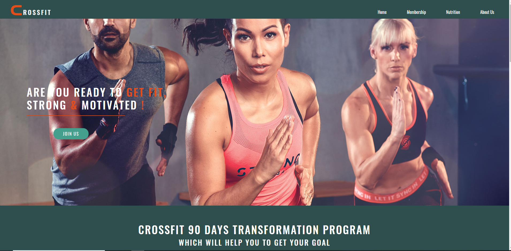
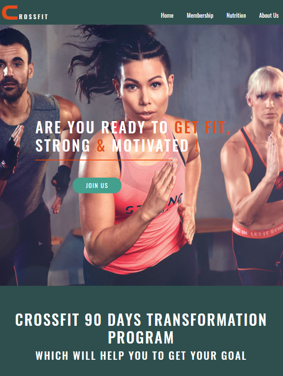

# Crossfit Fitness Club Webpage

## User-Centric Frontend Development Milestone-1 Project

Intention behind to build this Project is educational purpose(as a student of code institute) ! In this project I have used HTML for structure , CSS to style and finally media query & bootstap to make the project 
responsive on all devices. 

This project presents a fitness web page call Crossfit. whole project has five diffrent webpages each page has diffrent content but as user prospective 
each webpage  easily and smoothly will navigate user to their destination.

 ## [live webpage of my project ]( https://jas-sin82.github.io/milestone-project-1/)

 ---

## Screenshoots of project 

# Desktop, Ipad & Mobile
  

 # Highlights

 * [User Experience (UX)](#User-experience-UX)
  
    * [business prospective](#business-prospective)
    
    * [User Desire](#user-desire)
      
       * [New user desire ](new-user-desire)
       
       * [Returning user desire](returning-user-desire)

    * [User Stories](#user-stories)

    * [Wireframes of website](#wireframes-of-website)

    * [Surface](#surface)

    * [Features](#features)

    * [Technology used in a Project](#technology-used-in-a-Project)

    * [ Functionality Test ](#functionality-test)
           
        * [Code Validation Test](#Code-validation-test)

        * [ Performance Testing ](#performance-testing)

       

