# Crossfit Fitness Club Webpage

## User-Centric Frontend Development Milestone-1 Project

Intention behind to build this Project is educational purpose(as a student of code institute) ! In this project I have used HTML for structure , CSS to style, media query & bootstap to make the project 
responsive on all devices.

This project presents a fitness web page call Crossfit. whole project has four diffrent webpages each page has diffrent content but as user prospective 
each webpage  easily and smoothly will navigate user to their destination.

 ## [live webpage of my project ]( https://jas-sin82.github.io/milestone-project-1/)

 ---

## Screenshot of project 

# Desktop, Ipad & Mobile
  

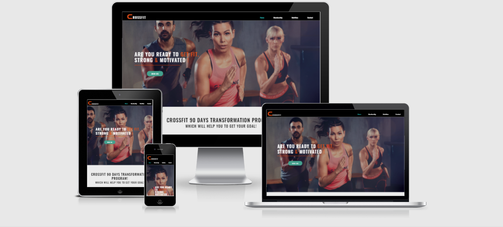

# Highlights

 * [User Experience (UX)](#User-experience-UX)
  
    * [Business Prospective](#business-prospective)
    
    * [User Desire](#user-desire)
      
       * [New user desire ](#new-user-desire)
       
       * [Returning user desire](#returning-user-desire)

    * [User Stories](#user-stories)

    * [Wireframes of website](#wireframes-of-website)

    * [Surface](#surface)

    * [Features](#features)

    * [Technology used in a Project](#technology-used-in-a-Project)

    * [Testing](#testing)

        * [ Functionality Test ](#functionality-test)

        * [ Compatibility testing ](#Compatibility-testing) 

        * [Error found during site development ](#Error-found-during-site-development)
           
        * [ Code Validation Test ](#code-validation-test)

        * [ Performance Testing ](#performance-testing)

    * [Deployment](#Deployment)    

    * [Credits](#credits)

    * [Screenshots of complete project](#screenshots-of-complete-project)

       

 # User Experience (UX)

 ## Business Prospective

  As business prospective this product has some unique offers to their custromers & toward potential customers as well such as crossfit offers crossfit-bar drinks 
  on some discounts to all of their customers, one of the best thing crossfit offers thats is  4 membership cards each card contains pile of benefits to thier customers on 
  reasonable prices and much more such as interior, Nutrition coaching packages and we provide the best environment to perform a exercise.

## User Desire

### New User Desire

   * New user will find easily the right destination because of navigation links provided in  nav bar  and footer as well which will lead new 
     user direct to their destination page.

   * Easily to find contact informatiom by 2 ways one is footer their user can find all contact  in detail and  2nd one is just click on contact link inside footer will lead 
     user to contact page.

   *  The apparent information given about the packages and package price which will help new user to choose suitable one.

 ###   Returning User Desire

   *  User is able to contact their dietitian/trainer through call or messages.

   *  User is able to check weather their is any empty indvidual training session by just simple call , email or contact form.

   *  User can uppgrade their membership(to any level) any time just simple call , Email or through contact form as well.

[Back to Highlights ](#highlights)

## User Stories  

### New Customer 

   *  New user wish to know about Crossfit-bar such as how much discount or is their any complimentary drinks inside membership.

   *  New user would like to  know about trainers/dietitian qualification before the choose membership plan or Nutrition plan.

   *  New user want know is there zoom classes inside any particular membership.

### Returning Customer  

   * User need to direct contact to trainer to know more about (schedule) training session.

   *  User has a platinum mebership( platinum mebership offer to bring a friend/family member 2 times / month (completely free) & user want to know 
      is there any specfic time or day or just any time.   

   *  User want to uppgrade his/her Nutrition plan. 

 [Back to Highlights ](#highlights)

# Wireframes of website

 ### I used a balsamiq to create a wireframe. Here is link [balsamiq](https://www.balsamiq.com/)
 
 
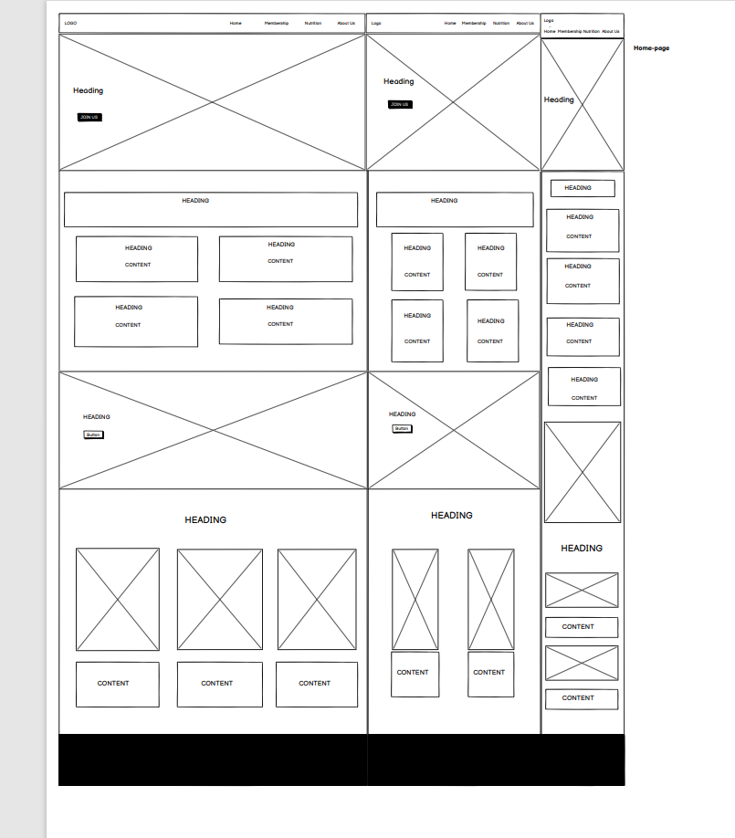
    
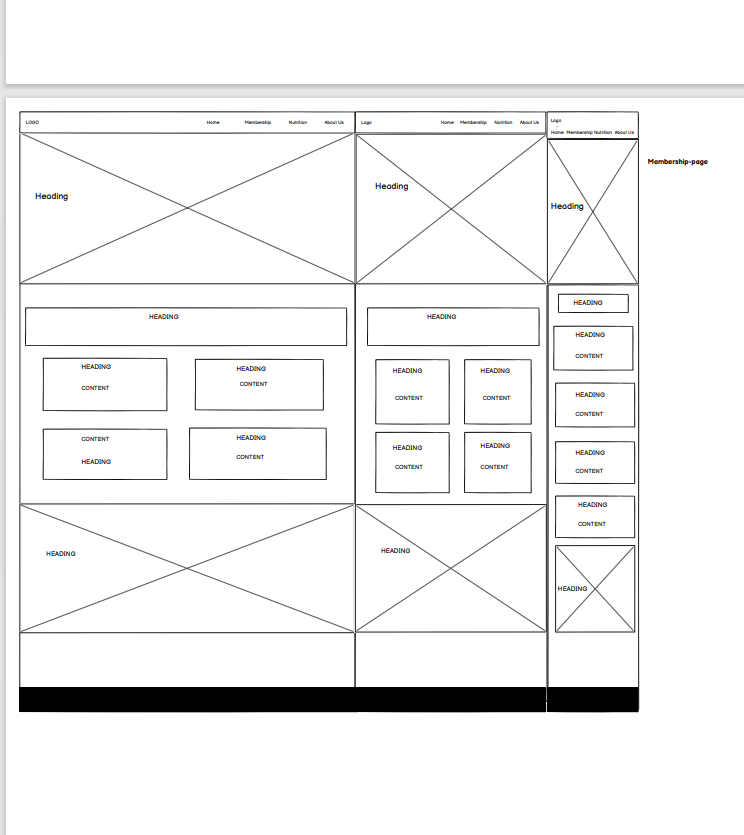

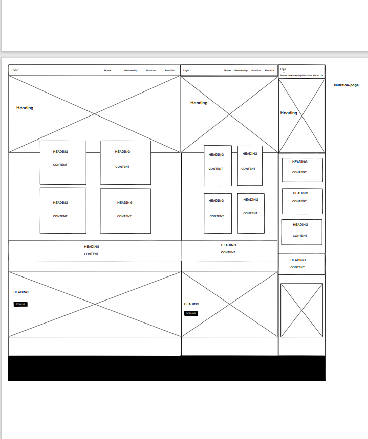

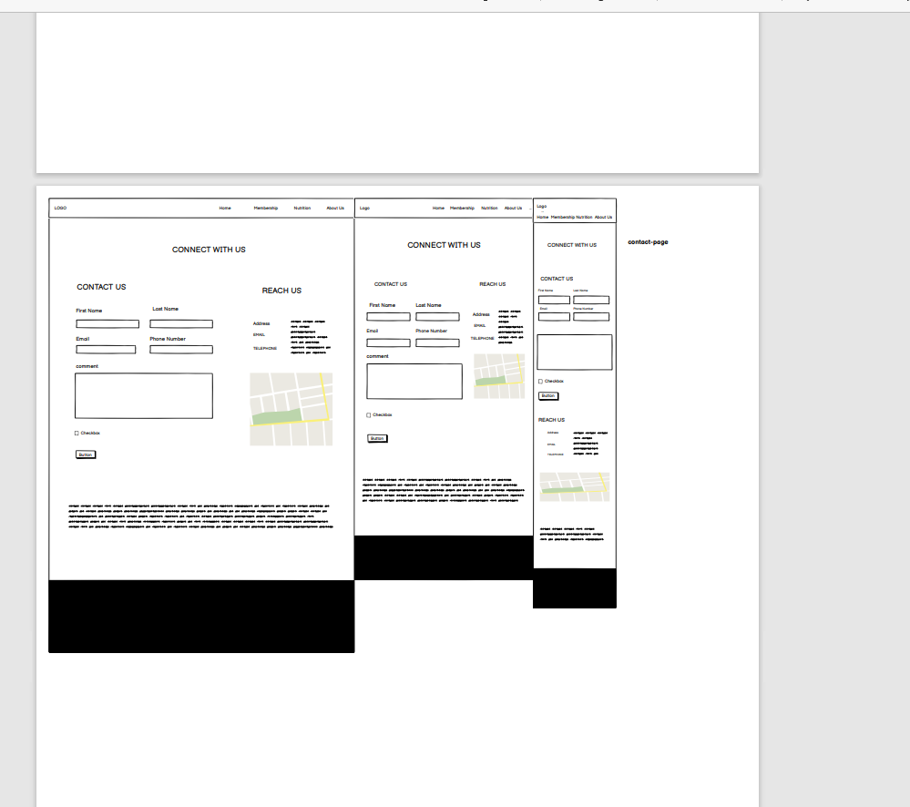

# Surface

## colors 

Color used in a project 

  * Font-Color
    
    *  white

    *  orangered 
     
    *  #6dd5ed

    *  rgb(228, 77, 23)

 *  Background-Color 

    * rgb(19, 26, 26, 0.973)

    * white

 ## Fonts used in project 

  * Font-Family 

    * font-family: 'Oswald', sans-serif;

    * font-family: 'Zen Dots', cursive;

##  Images 

 some of Images upload from google images [google-images](https://www.google.se/search?q=fitness+images&sxsrf=ALeKk01h26nfJNxMvj_uz38YHq6Ov_cBGQ:1620046287720&source=lnms&tbm=isch&sa=X&ved=2ahUKEwik1P7bxq3wAhUPAxAIHdjaBVMQ_AUoAXoECAEQAw&biw=1920&bih=937)  
and some of them from  unspalsh website [unspalash](https://unsplash.com)

[Back to Highlights ](#highlights)

# Features

 Website consists of 4 pages and all the web page function good. Each webpage contains diffrent contents.

  ## Navigation-Bar 
  
  Navigation bar has four links each links work completely and Crossfit logo on a left side of navigation bar which is link to the home page.

  * Home 

  * Membership 

  * Nutrition 

  * Contact

  ## Cards 

  Each page has own card section

  *  Transformation section  (Home page) 

  *  Membership Plan ( Membership page)
  
  *  Nutrition Plan ( Nutrition page)

  ## Footer

  * Footer has divided in to 4 section  first section about customer service. 

  * 2nd section has 4 links which are completely work.
    
     *  Home

     *  Membership

     *  Nutrition

     *  Contact 

  * 3rd section about company background.

  *  4th and last section address and social links.

  ## Future development

  * First I want create a Login page so user can login with user name and password so they can get all details just by one login. 

  * The next development will be one extra html page which will contain price of crossfit bar drinks.
   
  *  Payment system so user will be able to  pay easily by online payments for Zoom classes and Nutrition packages as well.
  
  [Back to Highlights ](#highlights)
  
  # Technology used in a Project

  ## HTML 

  * To create whole structure of project.

  ## CSS 

  * TO style the whole structure of project.

  ## Bootstrap & Media Query 

  * To make it responsive on all the devices such as Desktop , Ipad  and Mobile.

  ## Font-Awesome  

  * Use for Icon links and Icon .

  ## Wireframes
   
   * Use balsamiq as a wireframe  tool.

   ## Google Font 

   *  To make structure beautiful 

   ## Github 

   * To keep project safe and publically on cloud.

   ## Gitpod 

   Used as code editor to create my project. 

 [Back to Highlights ](#highlights)

   # Testing 

  ##  Functionality Test 

   * I used  Chrome developer tools throughout the project for testing and solving problems with responsiveness and style issues.
 
  ##  Compatibility Testing 

   *   Project has been tested on different devices such as Desktop, Ipad and on diffrent Mobiles Iphone x, Iphone 6,7,8 , Samsung Note 20 ,Iphone 5 ,Iphone4,
      Nexus and it works great.Webpage is fully responsive on all devices.

## Error found during site development 

   * During the site development I found the error in nutrition.html ( webpage had horigental space) even I used margin 0 padding 0 in external css to
    removes all default margin and padding for every object on the page but it did not helped. 

    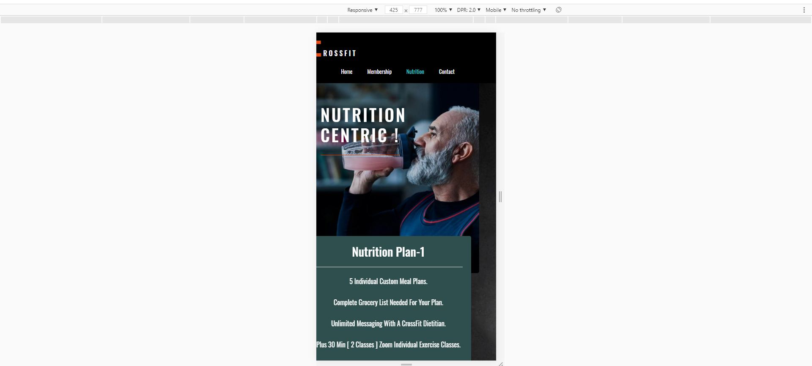

   *  To remove this space I decided to test internal css To fix this error, I used internal css body,html { margin= 0, padding = 0, width:100% ,height: 100%,                  overflow-x:hidden} After when I inculde this line of code error was resolved. 
  
  ## Performance Testing 

  I have used lighthouse tool to check the performance of website. Here is link [Lighthouse](https://developers.google.com)

   
   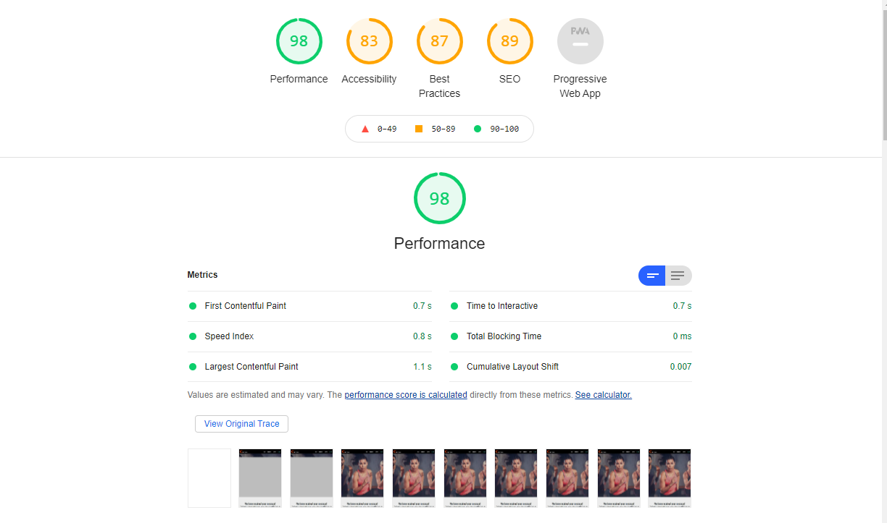

   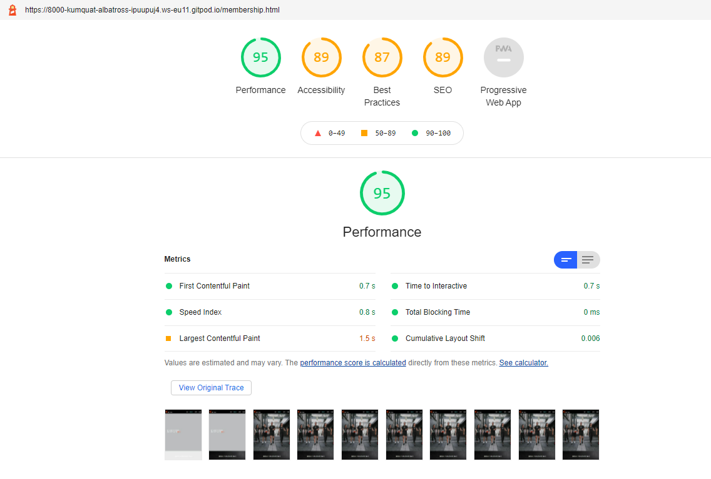 

   

   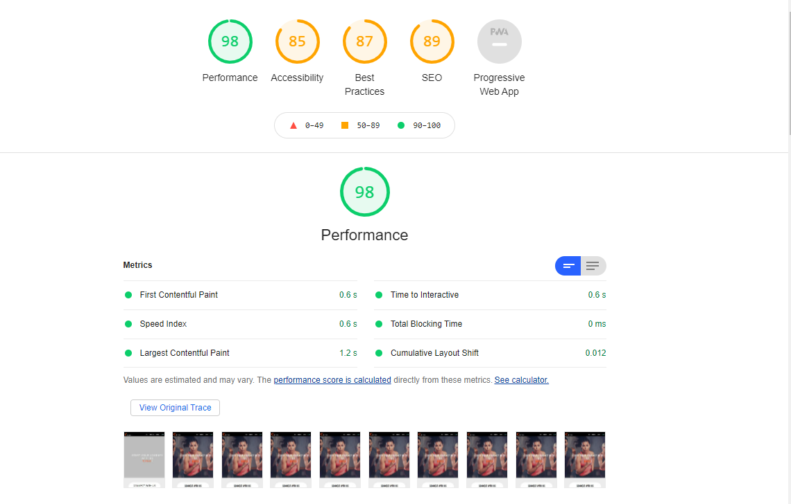

  ## Code Validation Test 

  I have checked up the validity of all the  Html webpages and CSS file  

   * [The W3C Markup Validation Service](https://validator.w3.org)

   * [The W3C CSS Validation Service ](https://jigsaw.w3.org)

  [Back to Highlights ](#highlights)

  # Deployment

   I used a Github pages to deployed my project. As I mentioned Above I have Used Gitpod as a code editor to create my project. To commit and push my code I have used Git control version 
   
   to save my project on Github.

   ###  HOw to deploy project on Github 

  * First we need to login in our account on Github.

  * Second  step we need to choose the repository to deploy.

  * 3rd  step we need to  go to setting and find git pages.

  * 4th step we need to choose branch in my case I have Master branch and then need to click on  save  and finally we will see our webpage will deploy.

   Your site is published at https://jas-sin82.github.io/milestone-project-1/ 

# Credits

  ## Contents 

  *  70 % of contents of my project is from 

  *  https://www.armourycoachingstudio.co.uk/

  *  https://www.mypersonaltrainerwebsite.com

  *  https://www.markpersonaltraining.com/

  ##   Hints & Ideas 

   *  W3Schools https://www.w3schools.com

   *  Bootstrap 4.3.1 https://getbootstrap.com 

  
  ## To finish this project I have used [Code Institute gitpod full template](https://github.com/Code-Institute-Org/gitpod-full-template) 

   # Screenshots of complete project

  [Back to Highlights ](#highlights)

  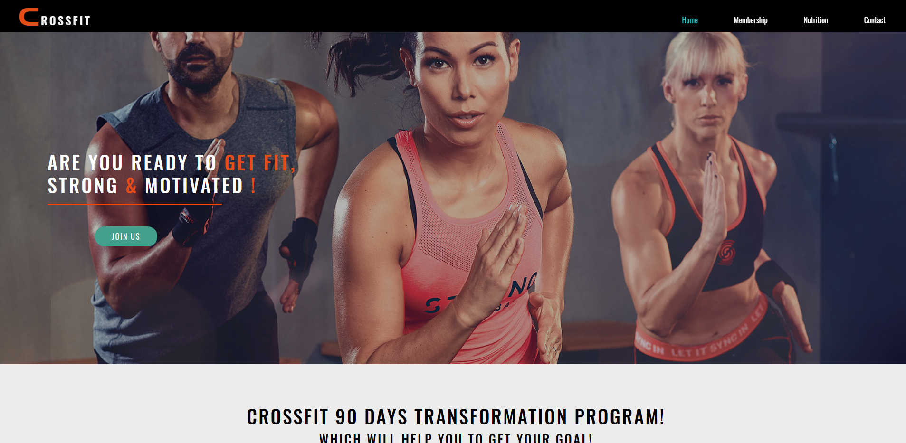
  
  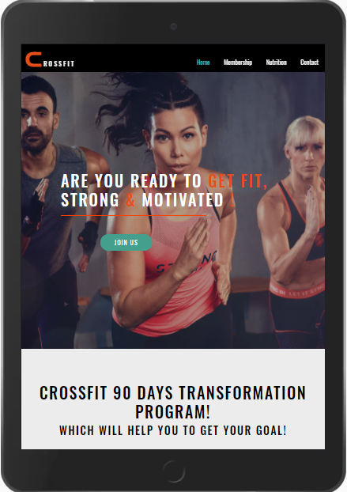

  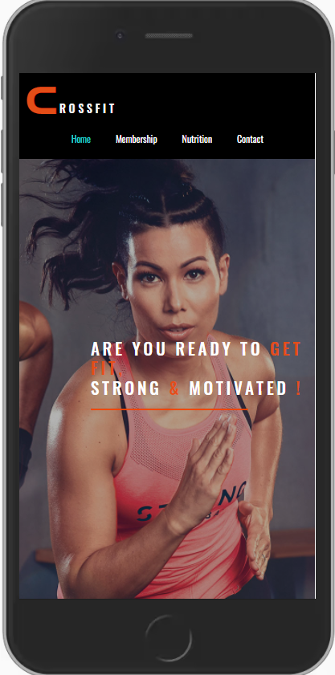

  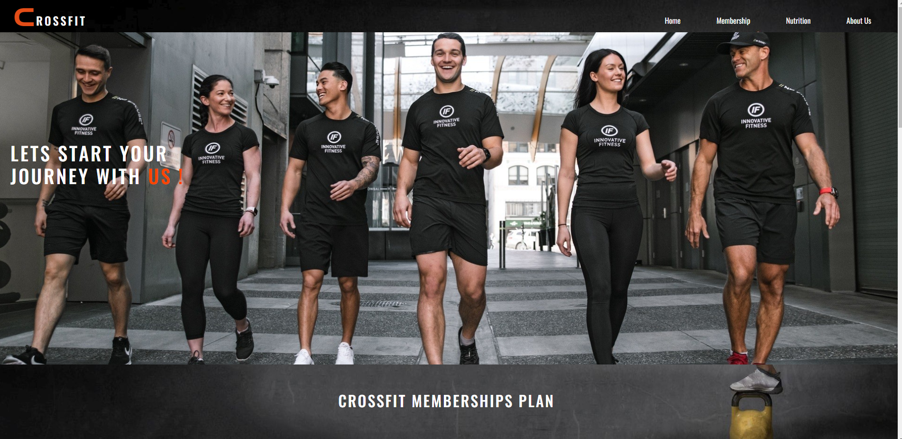

  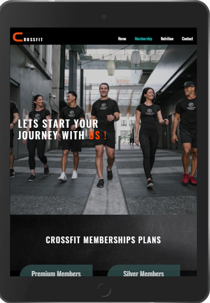

  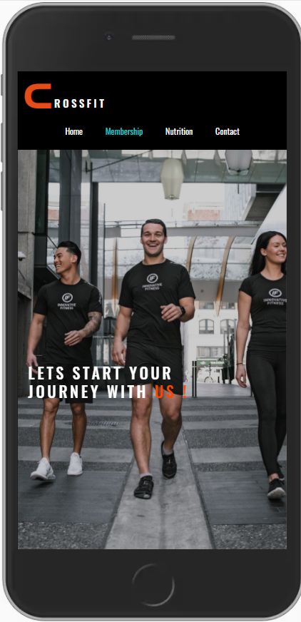

  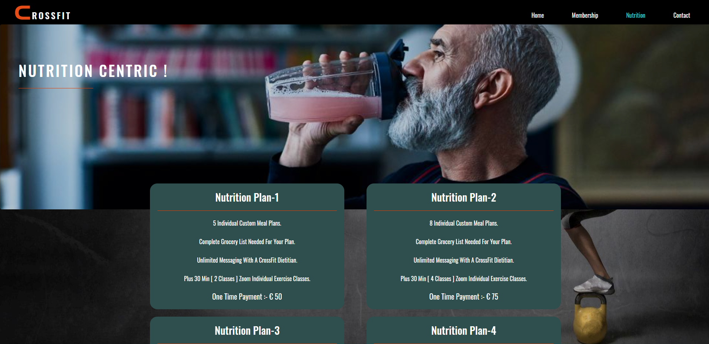

  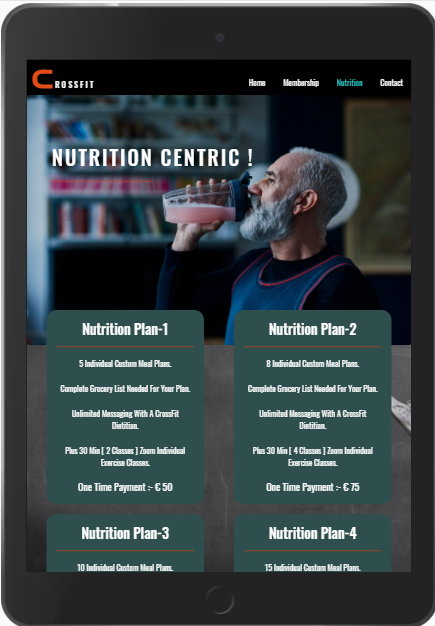

  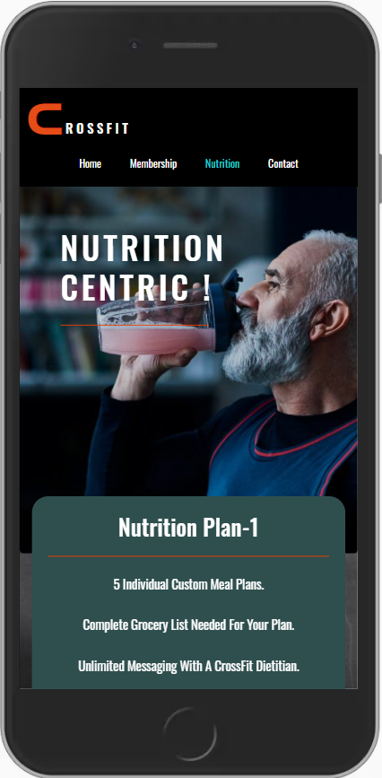

  

  

  [Back to Highlights ](#highlights)
   
   
   
 

    

